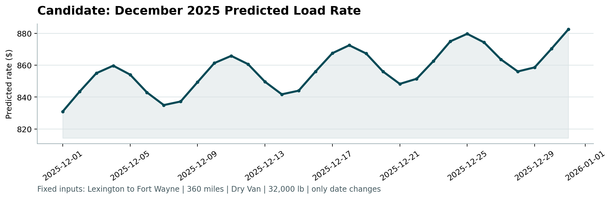

# Freight Rate Prediction

Predicts the posted rate of a truckload from its lane, equipment, weight, date and market index.
Trained on 48,000 loads (Jan to Oct 2025) and used to predict 12,000 loads (Nov to Dec 2025).

**Result on unseen months:** 1.50% MAPE, $35.64 MAE (rate-card baseline: 4.15%, $96.00).
Report: [reports/report.pdf](reports/report.pdf)



## How to run

Requires Python 3.10+.

```bash
git clone https://github.com/Sajjad01-chaus/Freight-Rate-Prediction.git
cd Freight-Rate-Prediction
python -m venv .venv
.venv\Scripts\activate            # macOS/Linux: source .venv/bin/activate
pip install -r requirements.txt
python run_all.py
```

`run_all.py` runs the tests, trains the model, writes the predictions and runs the provided `score.py` (about 1 minute). It produces:

| File | Content |
|---|---|
| `validation_predictions.csv` | 12,000 rows, `load_id,predicted_rate` |
| `data/december_chart_inputs.csv` | `predicted_rate` filled for the 31 December rows |
| `scorer_results/candidate_december.png` | December chart from `score.py` |
| `reports/prediction_checks.md` | input coverage and prediction sanity checks |

`python run_all.py --full` also regenerates the EDA figures, the model comparison, the accuracy analysis and the PDF report (about 20 minutes).

Individual steps:

```bash
python scripts/eda.py            # EDA figures
python scripts/experiments.py    # model comparison on the time folds
python scripts/compare_algorithms.py  # LightGBM vs XGBoost vs forests for the load part
python scripts/train.py          # train the final model
python scripts/predict.py        # predictions + December file
python scripts/insights.py       # accuracy bands and price range
python scripts/build_report.py   # reports/report.pdf
python -m unittest discover -s tests
```

## Approach

**Data cleaning**
- 677 loads (1.4%) have corrupted rates (0.16x to 0.45x or 2.1x to 5.2x of similar loads). Removed from training.
- Negative weights are sign errors (absolute value used). Missing weights filled with the median.
- Missing market index filled with that day's average, since it is a daily value.

**Validation**
The loads to predict come after the training period, so a random split would overstate accuracy. Each fold trains on all earlier months and tests on the next two:

| Fold | Train | Test |
|---|---|---|
| Q2 | Jan to Apr | May to Jun |
| Q3 | Jan to Jul | Aug to Sep |
| X1 | Jan to Jun | Jul to Aug |
| X2 | Jan to Aug | Sep to Oct |

**Model**
```
log(rate) = market part (linear)   +  load part (LightGBM)   +  lane premium
            market index               distance, equipment,      per-lane residual,
            quarter-end ramp           weight, coordinates       shrunk for small lanes
            monthly trend
```
Time-related effects are in a small linear model so they extend into Nov to Dec. The trees only see load features, because given the daily market index they memorised individual days instead of learning prices.

| Model | Mean MAPE | Mean MAE |
|---|---|---|
| Rate-card baseline | 4.15% | $96.00 |
| Linear model with trend | 2.02% | $46.45 |
| LightGBM with time feature | 2.22% | $50.62 |
| Hybrid, standard trees | 1.66% | $38.12 |
| **Final: hybrid, linear trees, 5 seeds, lane premium** | **1.50%** | **$35.64** |

Full results: [reports/experiments.md](reports/experiments.md). XGBoost in the same design scores 1.61% (same as LightGBM's standard trees); linear-leaf trees reach 1.53%: [reports/algorithms.md](reports/algorithms.md).

**Main finding:** rates rise over the last month of every quarter and drop when the next quarter starts. By the last day the uplift is +7.9% for Flatbed, +5.0% for Reefer and +2.4% for Dry Van. December is a quarter end, so the December chart rises through the month.

## Project structure

```
src/freight/     data cleaning, features, models, validation folds
scripts/         eda, experiments, train, predict, insights, build_report
tests/           unit tests
reports/         report.pdf, figures, results tables
data/            input files
run_all.py       runs the full pipeline
score.py         provided scorer
```
